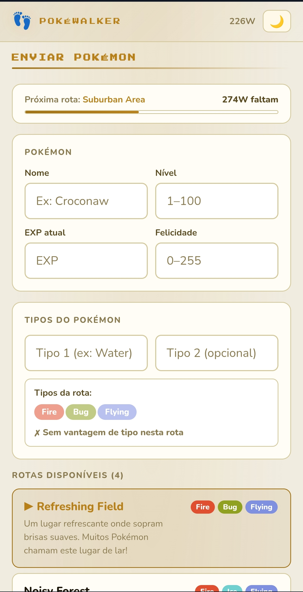
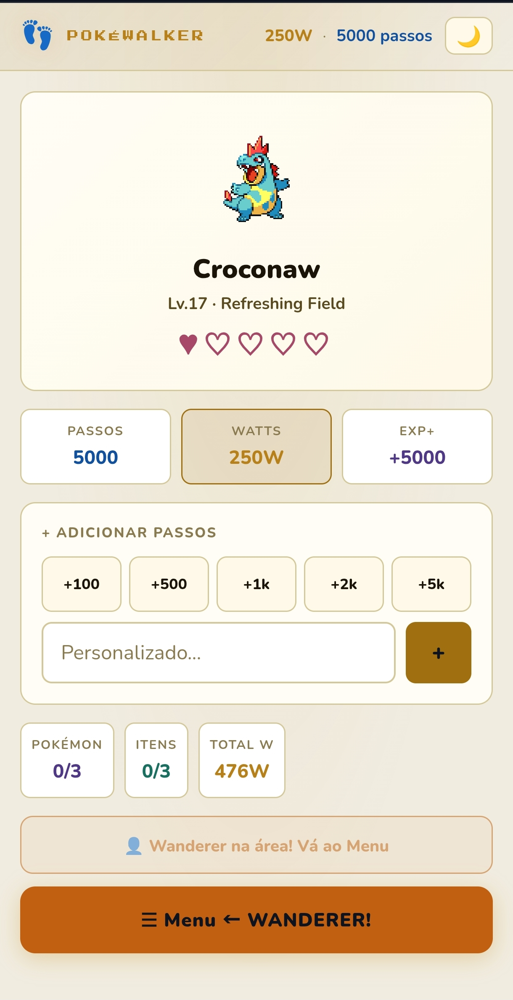
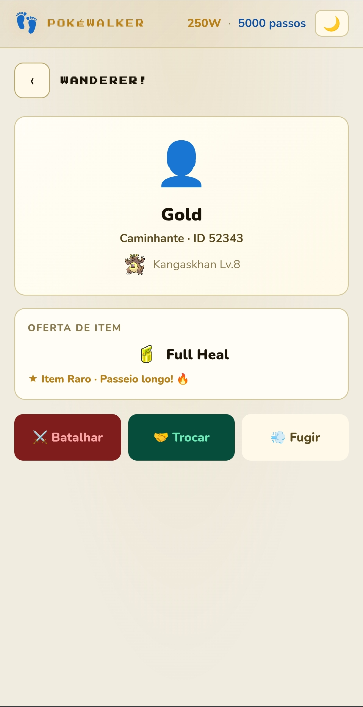
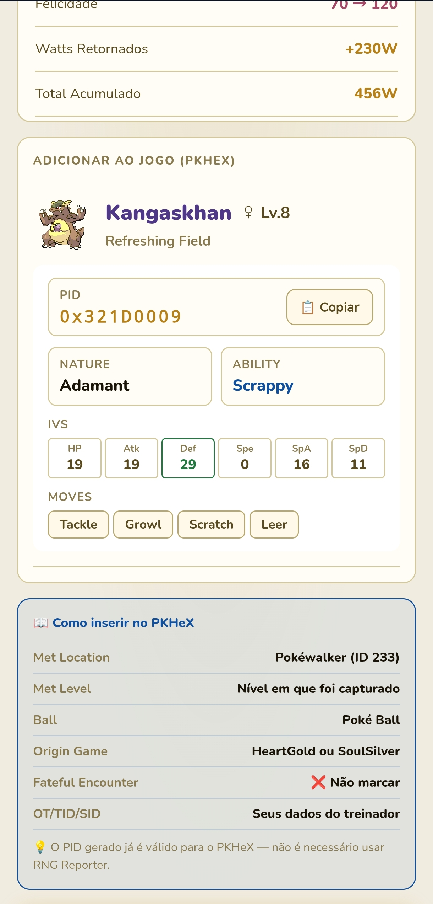
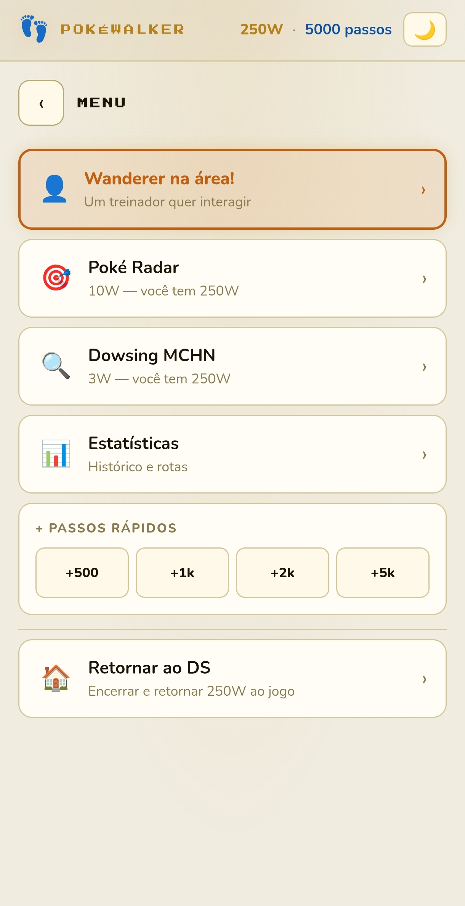

# 🦶 Pokéwalker Virtual — HeartGold / SoulSilver

> Emulador fiel do Pokéwalker para Pokémon HeartGold e SoulSilver, com geração de dados compatíveis com o PKHeX.

**🔗 Acesse agora:** [peverell17.github.io/pokewalker-hgss](https://peverell17.github.io/pokewalker-hgss/)

---

## 📸 Screenshots

<div align="center">

| Tela Principal | Menu | Wanderer |
|:-:|:-:|:-:|
|  |  |  |

| Resultado PKHeX | Enviar Pokémon |
|:-:|:-:|
|  |  |

</div>

---

## 📖 O que é isso?

O Pokéwalker era um acessório físico do Nintendo DS lançado junto com Pokémon HeartGold e SoulSilver em 2009. Ele permitia levar um Pokémon para passear no mundo real, ganhar EXP, Watts, capturar Pokémon e encontrar itens — tudo contando seus passos.

Este projeto é um emulador completo do Pokéwalker que roda direto no navegador do celular, sem precisar do acessório físico. Todos os dados gerados são compatíveis com o **PKHeX**, o editor de saves mais usado pela comunidade Pokémon.

---

## ✨ Funcionalidades

### 🔬 Mecânicas fiéis ao hardware original
- RNG real do firmware — mesmas constantes LCG e IRNG do hardware (documentadas por dmitry.gr)
- PID gerado com a fórmula real do Pokéwalker, aceito pelo PKHeX sem erros
- Nature nunca Quirky, Pokémon nunca Shiny — exatamente como o firmware original
- IVs gerados via LCG, independentes do PID
- Vantagem de tipo reduz em 25% o requisito de passos para Pokémon raros
- Balão de felicidade com Watts bônus (10W / 20W / 50W)

### 🗺️ 27 rotas completas
| Tipo | Quantidade |
|------|------------|
| Pré-Pokédex Nacional | 8 rotas |
| Pós-Pokédex Nacional | 12 rotas |
| Rotas de Evento | 7 rotas |

Todas com dados reais de Pokémon, itens, pesos e requisitos de passos baseados nos dados originais do jogo.

### 🎮 Mecânicas de jogo
- **Poké Radar** — batalhe e capture Pokémon (custa 10W)
- **Dowsing MCHN** — encontre itens escondidos nos arbustos (custa 3W)
- **Wanderer** — treinador NPC que aparece após 1000 passos, com opção de batalha ou troca de itens
- **Rare Boost** — ativado ao vencer o Wanderer, aumenta chance de Pokémon raros
- Sistema de bolsa com até 3 Pokémon e 3 itens por passeio

### 🎨 Interface
- Design inspirado em HeartGold e SoulSilver
- Tema claro ☀️ e escuro 🌙
- Sprites HGSS via PokéAPI com fallback por emoji
- PWA — pode ser instalado como app na tela inicial do celular
- Funciona offline após o primeiro carregamento

### 📊 Integração com PKHeX
- PID, Nature, Ability, IVs e Moves exibidos na tela de resultado
- Botão para copiar o PID direto para a área de transferência
- Guia integrado com todos os campos necessários no PKHeX
- Histórico completo de passeios com Pokémon capturados e itens encontrados

---

## 📱 Como usar

### 1. Preparação
Antes de iniciar, você precisará dos seguintes dados do seu save:
- Nome do Pokémon que vai passear
- Nível e EXP atual
- Felicidade atual
- Tipos do Pokémon (para calcular vantagem de tipo)
- TID e SID do seu treinador (nas configurações do app)

### 2. Passeio
1. Acesse o app e preencha os dados do Pokémon
2. Escolha uma rota desbloqueada
3. Adicione passos manualmente ou use os botões de atalho
4. Use o **Radar** (10W) para capturar Pokémon
5. Use o **Dowsing** (3W) para encontrar itens
6. Interaja com o **Wanderer** se ele aparecer
7. Clique em **Retornar ao DS** quando terminar

### 3. Inserindo no PKHeX
Na tela de resultado, o app mostra todos os dados necessários:

| Campo PKHeX | Valor |
|-------------|-------|
| Met Location | Pokéwalker (ID 233) |
| Ball | Poké Ball |
| Fateful Encounter | ❌ Não marcar |
| PID | Gerado pelo app (copie com o botão) |
| Nature / Ability / IVs | Gerados pelo app |

---

## 🛠️ Tecnologias

- **React 18** via CDN (sem build step)
- **Babel Standalone** para JSX no browser
- **PokéAPI** para sprites da geração IV HGSS
- **Service Worker** para funcionamento offline (PWA)
- **localStorage** para persistência do save

---

## 🚀 Rodando localmente

Não precisa de instalação. Basta abrir o `index.html` em um servidor local:

```bash
# Com Python
python3 -m http.server 8000

# Com Node.js
npx serve .
```

Depois acesse `http://localhost:8000` no navegador.

> ⚠️ Não abra o arquivo diretamente (`file://`) — o Service Worker não funciona sem HTTPS ou localhost.

---

## 📄 Licença

© 2026 peverell17. Distribuído sob a licença [CC BY-NC 4.0](https://creativecommons.org/licenses/by-nc/4.0/).

Você pode compartilhar e adaptar o material, desde que:
- Dê crédito ao autor original
- Não use para fins comerciais

Uso comercial, redistribuição sem crédito e modificações sem atribuição são proibidos.

---

## ⚠️ Aviso Legal

Este é um projeto **fan-made** criado para fins educacionais e de entretenimento pessoal.

Pokémon, HeartGold, SoulSilver e Pokéwalker são marcas registradas da **Nintendo / Game Freak / Creatures Inc.** Este projeto não tem afiliação oficial com nenhuma dessas empresas.

---

*Desenvolvido com 💛 por peverell17*
